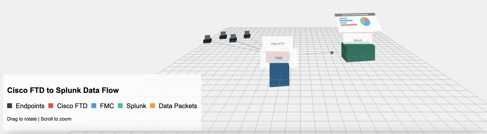

# Cisco FTD to Splunk Visualization

An interactive 3D visualization demonstrating the data flow from endpoints through Cisco Firepower Threat Defense (FTD) devices to Splunk for security analytics.

## 🚀 Demo

View the live demo: [https://josehelps.github.io/cisco-ftd-visualization](https://josehelps.github.io/cisco-ftd-visualization)



## ✨ Features

- Interactive 3D visualization built with Three.js
- Animated data packets showing the flow of information
- Detailed architecture showing endpoints, FTD, FMC, and Splunk
- Full camera controls (rotation, zoom)
- Responsive design that works on desktop and mobile devices

## 🛠️ Technologies

- Three.js for 3D visualization
- Vanilla JavaScript
- HTML5 & CSS3

## 🏗️ Setup and Development

### Prerequisites

- A modern web browser
- A local web server (optional, but recommended)

### Local Development

1. Clone this repository:
```bash
git clone https://github.com/josehelps/cisco-ftd-visualization.git
cd cisco-ftd-visualization
```

2. Start a local server (choose one method):

Using Python:
```bash
# Python 3
python -m http.server 8000

# Python 2
python -m SimpleHTTPServer 8000
```

Using Node.js:
```bash
# Install serve globally
npm install -g serve

# Run the server
serve
```

3. Open [http://localhost:8000](http://localhost:8000) in your browser to see the visualization.

## 📱 Embedding

To embed this visualization in your blog or website, use an iframe:

```html
<iframe 
  src="https://josehelps.github.io/cisco-ftd-visualization" 
  width="100%" 
  height="600px" 
  frameborder="0" 
  allowfullscreen>
</iframe>
```

## 🌟 How It Works

The visualization shows:

1. **Endpoints** (gray boxes) generating network traffic
2. **Cisco FTD** (red box) processing and filtering the traffic
3. **Firewall Management Center (FMC)** (blue box) managing the FTD configuration
4. **Splunk** (green box) ingesting logs and providing security analytics
5. **Data Packets** (yellow spheres) flowing through the system

Each component represents a key part of the security architecture:

- **Endpoints** represent user workstations generating network traffic
- **Cisco FTD** provides next-generation firewall capabilities
- **FMC** centrally manages firewall policies and configurations
- **Splunk** analyzes security data to detect and respond to threats

## 📦 Project Structure

```
cisco-ftd-visualization/
├── index.html          # Main HTML file
├── visualization.js    # Three.js visualization code
├── preview.png         # Preview image
└── README.md          # This file
```
